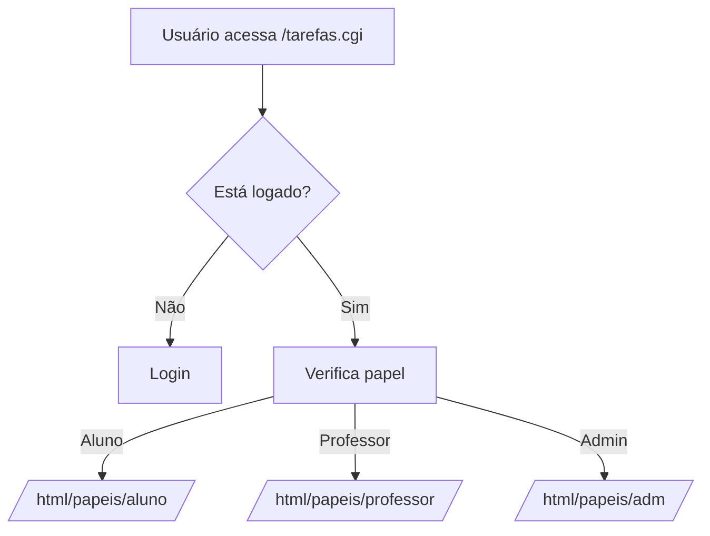

# 🧠 Visão Geral do Sistema

O projeto **tarefas2** é um **sistema web acadêmico** escrito majoritariamente em **C (CGI)**, com PHP e HTML em algumas partes. Ele funciona como um **gerenciador de tarefas escolares** — com papéis definidos para usuários (professor, aluno, administrador), gerenciamento de turmas e avaliações.

Ele **não é um site PHP tradicional** — ele usa **CGI em C**, executando scripts diretamente no servidor Apache ou via Docker.

---

# ⚙️ Estrutura Principal

### 📌 `tarefas.c` — *Arquivo principal (entrada do sistema)*  
Este é o programa **CGI principal**. Ele:
1. Inicia a sessão do usuário.
2. Carrega as bibliotecas do sistema.
3. Identifica o papel do usuário (aluno/professor/admin).
4. Redireciona para o módulo adequado:
   - Login
   - Professor (tarefas e turmas)
   - Aluno (resolução de tarefas)
   - Administrador (cadastros e controle)

**Resumo do fluxo:**
```c
#include "bib/cgi/controlesessao.h"
#include "bib/cgi/login/login.h"
#include "bib/cgi/papeis/papeis.h"

int main () {
   // verifica sessão existente
   // se não estiver logado → login()
   // se logado → direciona para o papel (aluno, prof, admin)
}
```

# 📚 Bibliotecas Importantes

| Biblioteca          | Função                               |
|---------------------|---------------------------------------|
| `bib/cgi/login`     | Sistema de login e autenticação       |
| `bib/cgi/papeis`    | Define o papel do usuário             |
| `bib/bd/tarefasbd.h`| Banco de dados de tarefas             |
| `bib/imagem.h`      | Upload/exibição de imagens            |
| `bib/diretorio.h`   | Manipulação de arquivos no servidor   |
| `bib/str/*`         | Tratamento de strings e HTML          |


A estrutura demonstra que o projeto é modular e organizado por camadas.

# 👥 Papéis do Sistema

O sistema é baseado em perfis de acesso:

📌 Aluno

* Visualiza tarefas.

* Envia solução.

* Recebe feedback.

📌 Professor

* Cria tarefas.

* Configura avaliações.

* Analisa estatísticas (confAval/).

📌 Administrador

* Cadastra disciplinas, professores e turmas.

# 🧪 CGI Modular — Cada Ação é um Executável C

Dentro de:

html/papeis/professor/minhasturmas/paginaturma/trabalho/tarefa/


Existe a pasta confAval/ com vários arquivos .c, um para cada etapa da configuração de uma avaliação:

| Arquivo        | Função                           |
|----------------|----------------------------------|
| `cab.c`        | Cabeçalho da página              |
| `gerCt.c`      | Configurar critérios de avaliação|
| `avalEstat.c`  | Estatísticas de desempenho       |
| `sol.c`        | Visualizar solução do aluno      |
| `feedback.c`   | Feedback da correção             |
| `salvarCt.c`   | Salvar critérios                 |
| `execCt.c`     | Executar avaliação               |
Ou seja: cada ação do professor é um executável CGI separado.

# 🗄️ Banco de Dados

Não é utilizado MySQL diretamente. Há uma camada própria de banco, definida em tarefasbd.h, provavelmente armazenando as informações em arquivos .dat locais.

Isso facilita o deploy sem dependências externas.

💡 Resumo do Funcionamento


# 🧭 Pontos Fortes da Arquitetura

✔ Sistema bem modular

✔ Feito para ambiente acadêmico

✔ Sem dependência de banco externo

✔ Controle de sessão eficiente

✔ Separação clara por papéis

# 📌 Sugestões para Evolução
| Ideia                         | Benefício                         |
|------------------------------|-----------------------------------|
| Migrar para FastCGI ou PHP   | Mais performance                  |
| Usar MySQL ou SQLite         | Facilitar escalabilidade          |
| Criar API REST em C ou Python| Integrável com frontend moderno   |
| Criar UI com Vue/React       | Melhor experiência de usuário     |